# Portfolio Website - Architecture Diagram

## Project Overview
A Flask-based portfolio website with admin dashboard, project management, and user authentication.

---

## System Architecture

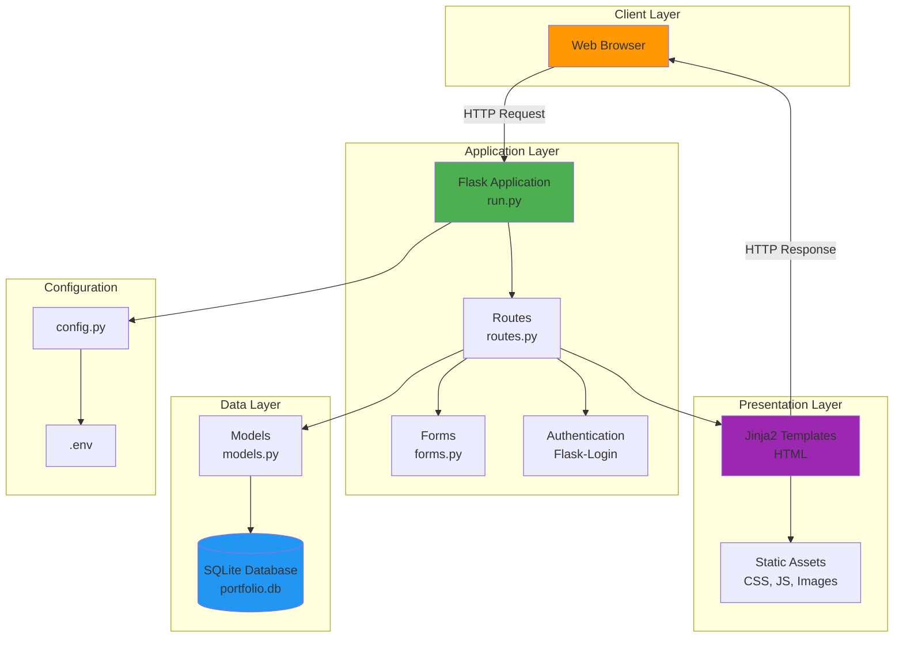

---

## Detailed Project Structure

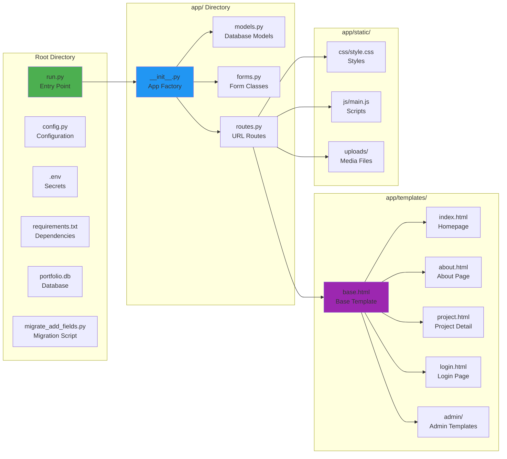

---

## Database Schema

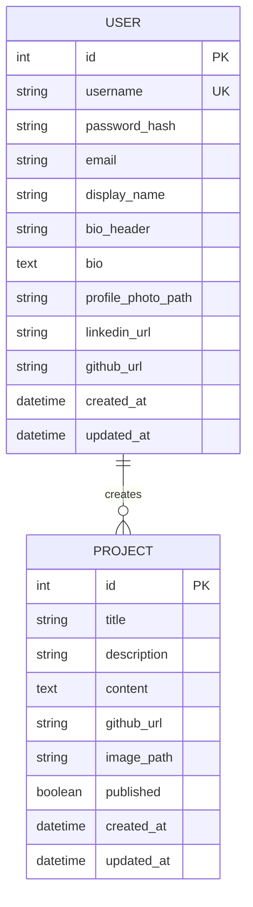

---

## Request Flow - Public Routes

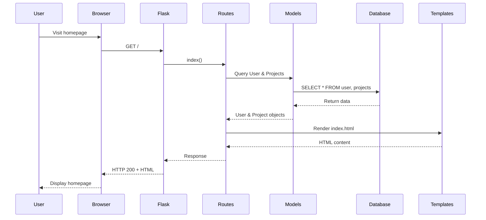

---

## Request Flow - Admin Routes

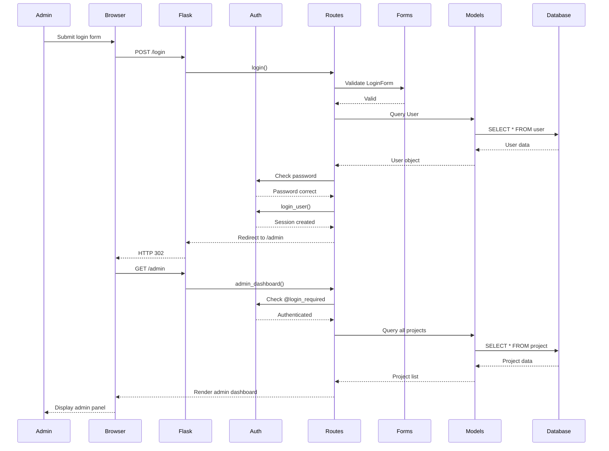

---

## Component Interactions

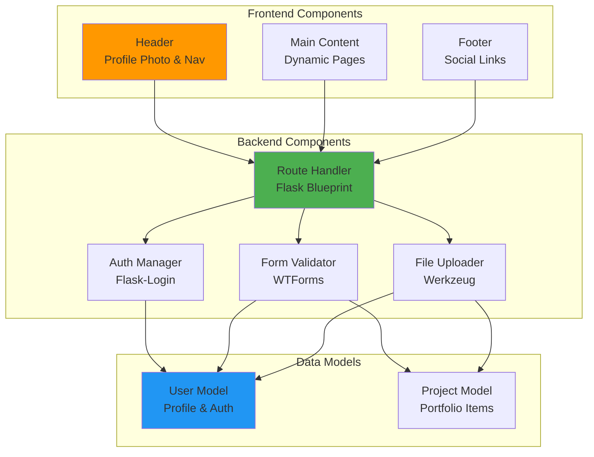

---

## File Upload Flow

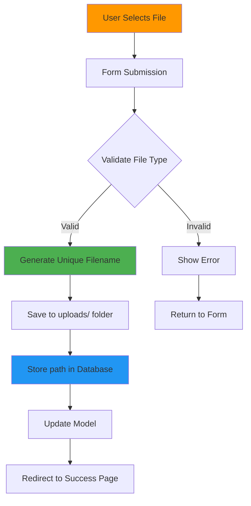

---

## Authentication Flow

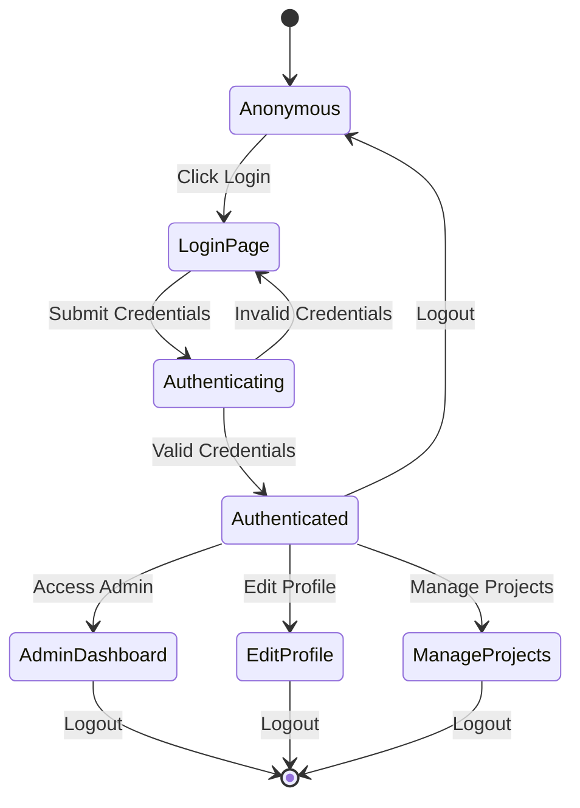

---

## Technology Stack

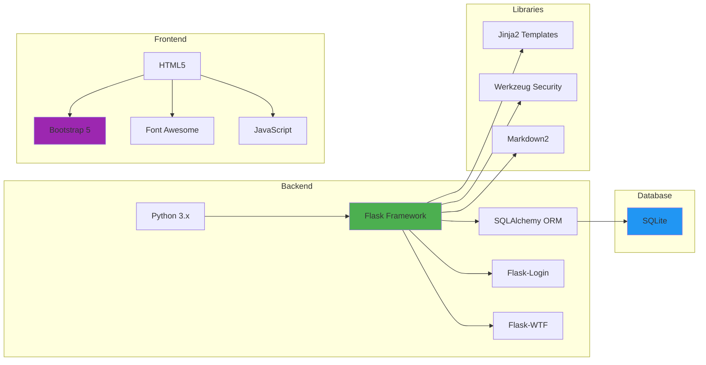

---

## Key Features Map

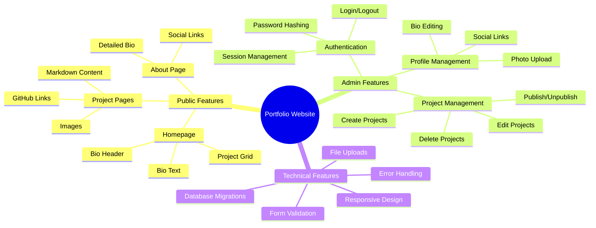

---

## Deployment Architecture

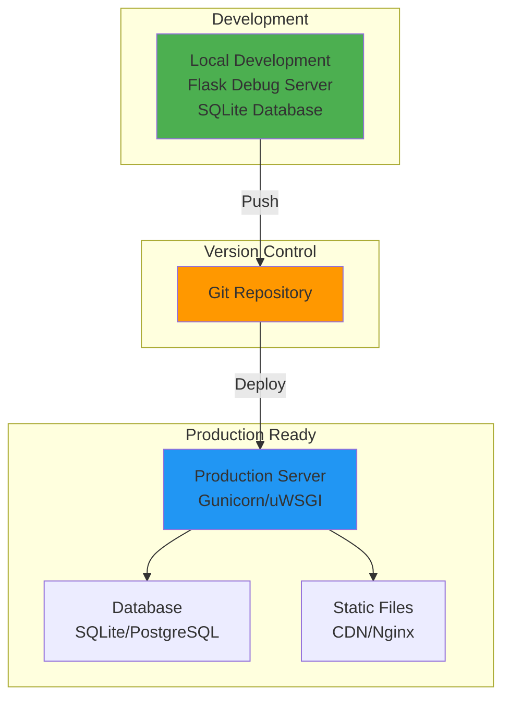

---

## Route Structure

```mermaid
graph TD
    Root[/ Homepage] --> Public{Public Routes}
    Root --> Admin{Admin Routes}
    Root --> Auth{Auth Routes}

    Public --> Index[/ - Homepage]
    Public --> About[/about - About Page]
    Public --> Project[/project/id - Project Detail]

    Auth --> Login[/login - Login Page]
    Auth --> Logout[/logout - Logout]

    Admin --> Dashboard[/admin - Dashboard]
    Admin --> EditProfile[/admin/profile - Edit Profile]
    Admin --> NewProject[/admin/project/new - New Project]
    Admin --> EditProject[/admin/project/id/edit - Edit Project]
    Admin --> DeleteProject[/admin/project/id/delete - Delete Project]

    style Public fill:#4CAF50
    style Admin fill:#FF9800
    style Auth fill:#2196F3
```

---

## Security Features

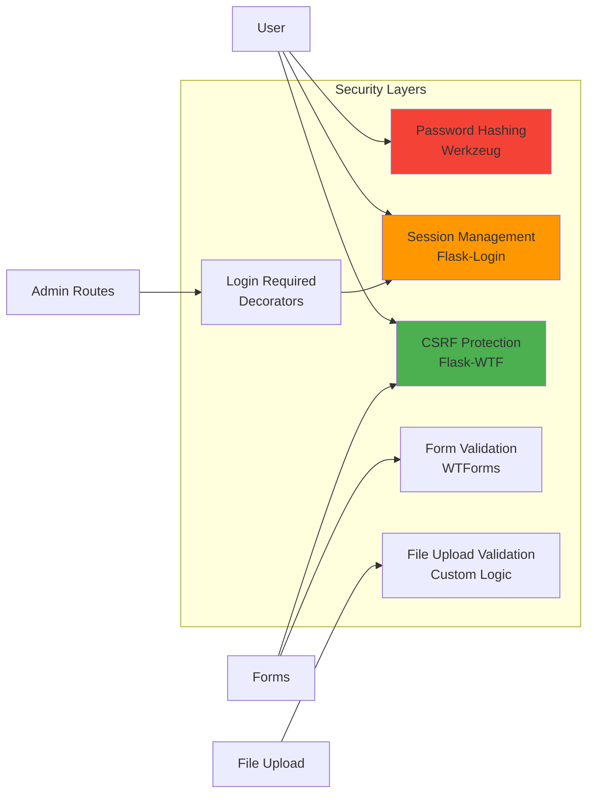

---

## View this diagram:
- On GitHub: This markdown file will render automatically
- In VSCode: Install "Markdown Preview Mermaid Support" extension
- Online: Copy to https://mermaid.live for interactive viewing
- Export: Use mermaid-cli to generate PNG/SVG files

## Generate Images:
```bash
# Install mermaid-cli
npm install -g @mermaid-js/mermaid-cli

# Generate PNG
mmdc -i ARCHITECTURE_DIAGRAM.md -o architecture.png

# Generate SVG
mmdc -i ARCHITECTURE_DIAGRAM.md -o architecture.svg
